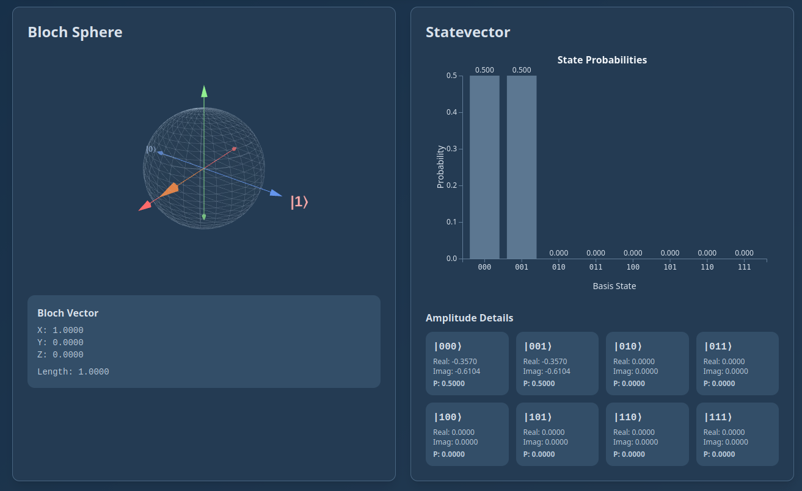
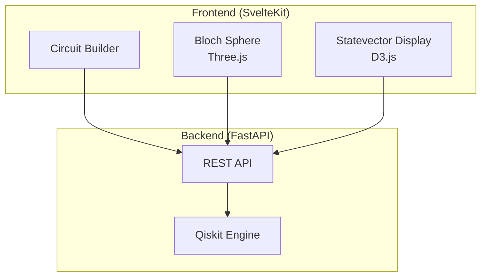

# Qiskit Viz

Interactive quantum circuit visualization tool that makes quantum computing concepts visual and accessible. Built with Svelte, Three.js, and Qiskit.

## Motivation

I wanted to learn more about the quantum computing space and thought it would be nice to have a more interactive UI to play around with than a jupyter notebook.



## Features

- **Interactive Circuit Builder** - Build quantum circuits with an intuitive drag-and-drop interface
  - Custom-styled number controls with +/- buttons
  - Real-time circuit operation tracking
  - Visual feedback for gate operations
- **3D Bloch Sphere** - Real-time 3D visualization of single-qubit quantum states using Three.js
  - Interactive OrbitControls for rotation and zoom
  - Color-coded RGB axes (X, Y, Z)
  - Dynamic state vector rendering
  - Dark theme optimized for visibility
- **Statevector Display** - Interactive probability distribution charts with D3.js
  - Animated bar charts with hover effects
  - Detailed amplitude information (real/imaginary components)
  - Support for multi-qubit systems
- **Circuit Information** - View circuit metadata including QASM output and circuit depth
- **Real-time Execution** - Run quantum circuits and see results instantly with visual feedback
- **Modern Dark UI** - Fully responsive interface with sophisticated dark color scheme
  - Muted blue-gray primary palette
  - Purplish-blue accent for primary actions
  - Custom-themed visualizations
- **Quantum Gates** - Support for H, X, Y, Z, S, T, Sdg, Tdg, and parameterized rotation gates (RX, RY, RZ)

## Quick Start

### Using Docker (Recommended)

```bash
# Clone the repository
git clone git@github.com:davidroeca/qiskit-viz.git
cd qiskit-viz

# Start the application
make up

# View logs
make logs

# Stop the application
make down
```

Visit:
- Application: http://localhost (via Traefik reverse proxy)
- Backend API: http://localhost/api
- API Documentation: http://localhost/api/docs
- OpenAPI Spec: http://localhost/api/openapi.json

### Local Development

#### Prerequisites
- Node.js 24+
- Python 3.13+
- uv (Python package manager)

#### Frontend
```bash
cd frontend
npm install
npm run dev
```

#### Backend
```bash
cd backend
uv sync
source .venv/bin/activate  # On Windows: .venv\Scripts\activate
python main.py
```

## Usage

1. **Select Number of Qubits** - Use the +/- buttons to choose how many qubits for your circuit (1-5)
2. **Build Your Circuit** - Add quantum gates using the Circuit Builder
   - Choose a gate (H, X, Y, Z, S, T, Sdg, Tdg, RX, RY, RZ)
   - Select which qubit to apply it to
   - For rotation gates (RX, RY, RZ), adjust the angle parameter with the slider
   - Click "Add Gate" to add the gate to your circuit
   - Remove individual gates or clear the entire circuit
3. **Select Bloch Qubit** - Choose which qubit to visualize on the Bloch sphere
4. **Execute** - Click the "Execute Circuit" button (with play icon) to run the quantum simulation
5. **Visualize** - View results in:
   - **Circuit Information** - QASM code, circuit depth, and qubit count
   - **Bloch Sphere** - 3D visualization of the selected qubit's state
   - **Statevector** - Probability distribution and amplitude details for all basis states

## Architecture



## Tech Stack

### Frontend
- **SvelteKit** with Svelte 5 (runes API)
- **Tailwind CSS v4** with custom dark theme
- **Three.js** for 3D Bloch sphere visualization with OrbitControls
- **D3.js** for interactive probability charts
- **Lucide Svelte** for consistent iconography
- **Vitest + Playwright** for browser-mode component testing
- **TypeScript** with auto-generated API types from OpenAPI spec
- **@hey-api/openapi-ts** for API client generation

### Backend
- **FastAPI** with auto-generated OpenAPI/Swagger documentation
- **Qiskit 2.x** for quantum circuit simulation
- **uv** for fast Python package management
- **Python 3.13+**
- **Pydantic** for data validation

### DevOps
- **Docker** with multi-stage builds and user ID mapping
- **Docker Compose** with isolated volumes for dependencies
- **Traefik** reverse proxy for unified localhost access
- **Make** for build automation and developer commands
- **Hot reload** for both frontend and backend during development

## Development

### Make Commands

```bash
make help           # Show all available commands
make build          # Build Docker images
make up             # Start services
make down           # Stop services
make logs           # View logs
make restart        # Restart services
make shell-backend  # Open shell in backend container
make shell-frontend # Open shell in frontend container
make rebuild        # Full rebuild
make clean          # Remove containers and volumes
```

### API Endpoints

All endpoints are prefixed with `/api/v1`:

- `GET /api/` - API information and available endpoints
- `POST /api/v1/circuit/build` - Build a quantum circuit and get QASM/metadata
- `POST /api/v1/circuit/statevector` - Execute circuit and get statevector
- `POST /api/v1/bloch/{qubit}` - Get Bloch sphere coordinates for a specific qubit

Full API documentation available at http://localhost/api/docs

### Regenerating API Types

When backend API changes, regenerate the frontend types:

```bash
cd frontend
npm run sync-api-types
```

This fetches the OpenAPI spec from the running backend and generates TypeScript types and SDK client functions.

## Testing

### Frontend Tests
```bash
cd frontend
npm run test          # Run all tests
npm run test:unit     # Run tests in watch mode
npm run check         # Type checking
npm run lint          # Linting
```

## Project Structure

```
qiskit-viz/
├── frontend/        # SvelteKit application
├── backend/         # FastAPI application
├── docker-compose.yml
├── Makefile
└── README.md
```

## Roadmap

- Add two-qubit gates (CNOT, SWAP, etc.)
- Circuit diagram visualization
- Export circuits to QASM
- Real quantum hardware integration
- Save/load circuit functionality
- Circuit optimization suggestions
- Educational tutorials and examples

## Contributing

Contributions are welcome! Please feel free to submit a Pull Request.

## License

MIT License - see [LICENSE](LICENSE) file for details.

## Acknowledgments

- [Qiskit](https://qiskit.org/) - IBM's quantum computing SDK
- [Three.js](https://threejs.org/) - 3D visualization library
- [D3.js](https://d3js.org/) - Data visualization library
- [SvelteKit](https://kit.svelte.dev/) - Web application framework
- [Tailwind CSS](https://tailwindcss.com/) - Utility-first CSS framework
- [Lucide](https://lucide.dev/) - Beautiful open-source icons
- [FastAPI](https://fastapi.tiangolo.com/) - Modern Python web framework
